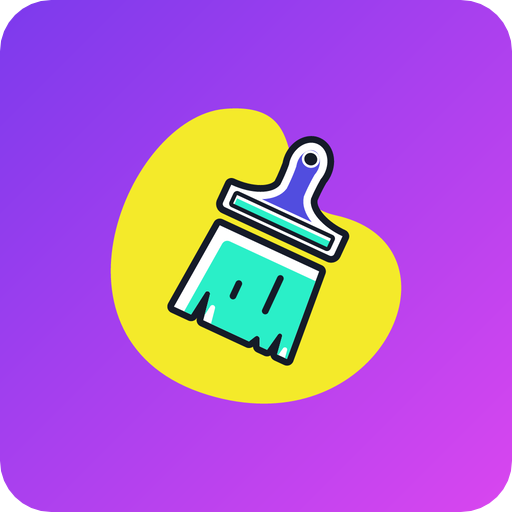
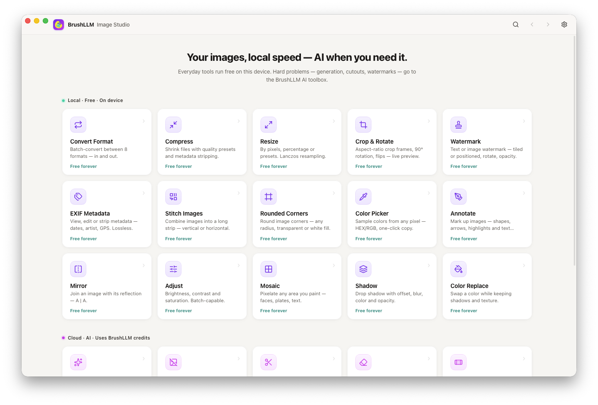

<p align="center">
  
</p>

<h1 align="center">BrushLLM Image Studio</h1>

<p align="center">
  <strong><a href="https://brushllm.com">🌐 brushllm.com</a></strong> · <a href="https://brushllm.com/docs">Docs</a> · <a href="https://github.com/BrushLLm/brushllm-image-studio/releases">Releases</a>
</p>

<p align="center">A local-first desktop image toolbox — everyday tools run 100% on your device for free; AI-powered editing calls the BrushLLM gateway.</p>

<p align="center">
  
</p>

## Download

Grab the latest installer from the [releases page](https://github.com/BrushLLm/brushllm-image-studio/releases/latest):

| System | File |
| --- | --- |
| macOS — Apple Silicon (M-series) | `.dmg` |
| Windows 10/11 — x64 (Intel/AMD) | `.exe` |
| Windows 10/11 — ARM64 (Snapdragon) | `.exe` |

Apps are unsigned — macOS Gatekeeper / Windows SmartScreen show a first-run warning.

[English](#english) | [Deutsch](#deutsch) | [Español](#español) | [Français](#français) | [Português (BR)](#português-br) | [简体中文](#简体中文) | [繁體中文](#繁體中文) | [日本語](#日本語) | [한국어](#한국어)

## English

### Tools

**15 local tools — free, offline, private:**

| Tool | What it does |
| --- | --- |
| Convert Format | Batch-convert between 8 input and 8 output formats |
| Compress | Shrink files with quality presets and metadata stripping — same-format output never grows |
| Resize | By pixels, percentage or presets — Lanczos resampling |
| Crop & Rotate | Aspect-ratio frames, 90° rotation, flips — live preview |
| Mirror | Join an image with its reflection — A \| A |
| Adjust | Brightness, contrast and saturation — batch-capable |
| Stitch Images | Combine images into one long strip |
| Watermark | Text or image watermark — tiled or positioned |
| EXIF Metadata | View, edit or strip — lossless |
| Rounded Corners | Any radius, transparent or white fill |
| Color Picker | Sample any pixel — HEX/RGB one-click copy |
| Annotate | Shapes, arrows, highlights and text notes |
| Mosaic | Paint-to-pixelate any area |
| Shadow | Drop shadow with offset, blur, color and opacity |
| Color Replace | Swap colors (up to 6 pairs) while keeping shadows and texture |

**7 AI tools — cloud-powered via [brushllm.com](https://brushllm.com) (billed per image):**
Generate Image · Remove Background · Cutout · Remove Watermark · Remove Object · Generative Fill (with optional reference images) · Restyle.

**Highlights:** dark mode · ⌘K command palette · batch processing · 9-language UI with 6 more planned.

### Languages

**Available now (9):** English · Deutsch · Español · Français · Português (BR) · 简体中文 · 繁體中文 · 日本語 · 한국어

**Planned:** Italiano · Nederlands · Polski · Türkçe · Bahasa Indonesia · Tiếng Việt

### Privacy

- Local tools run entirely on your device — your images never leave it.
- AI tools call the BrushLLM gateway with your own API key; the key lives in the OS keychain, never in a plain file.
- The only other network call is an anonymous GitHub release check for the update notification. Zero telemetry.

### Develop

```bash
npm install
npm run tauri dev      # dev app window
npm run tauri build    # release bundle for the current machine
```

Rust engine tests: `cd src-tauri && cargo test` — requires Node 22+, Rust stable.

### Architecture

- **UI** — React 19 + TypeScript + Vite in the system WebView (Tauri 2). `src/pages` (tool pages) → `src/components` → `src/lib/ipc.ts` (typed `invoke` wrappers).
- **Local engine** (`src-tauri/src/engine`) — a Rust image pipeline: `image` (JPEG/PNG/WebP/GIF/BMP/TIFF/ICO in), `resvg` (SVG in), `fast_image_resize` (SIMD Lanczos), `ravif` (AVIF out), `libwebp` (lossy WebP out), `kamadak-exif`. Input formats: 8 — JPEG, PNG, WebP, GIF (first frame), BMP, TIFF, ICO, SVG. Output formats: 8 — JPEG, PNG, WebP (lossy, quality slider), AVIF, SVG (embedded raster), TIFF, BMP, ICO.
- **Cloud** (`src-tauri/src/api/client.rs`) — the only code that talks to the BrushLLM gateway; separate base URLs for image edits and text-to-image; reference images sent as `image[]` parts (gpt-image models).

### Known limitations

- HEIC/HEIF and AVIF **input** are not supported (AVIF output works).
- WebP output is lossy (quality slider); SVG output embeds a raster image (not vector tracing); GIF inputs use the first frame.
- Apps are unsigned (code signing can be added to CI later).

## Translations

<details id="deutsch">
<summary>Deutsch</summary>

Ein lokal-first Desktop-Werkzeugkasten für Bilder — Alltagswerkzeuge laufen kostenlos auf deinem Gerät; KI-Bearbeitung nutzt das BrushLLM-Gateway.

**Lokale Werkzeuge (kostenlos, offline, privat):** Format konvertieren · Komprimieren · Redimensionieren · Rogneren & Drehen · Spiegeln (A \| A) · Anpassen · Bilder verbinden · Wasserzeichen · EXIF · Abgerundete Ecken · Farbpipette · Beschriften · Mosaik · Schatten · Farbwechsel.
**KI-Werkzeuge (Cloud, pro Bild abgerechnet):** Bild generieren · Hintergrund entfernen · Freistellen · Wasserzeichen entfernen · Objekt entfernen · Generatives Füllen (mit Referenzbildern) · Stil ändern.

**Highlights:** UI in 9 Sprachen · Dunkelmodus · ⌘K-Befehlspalette · Stapelverarbeitung · API-Schlüssel im OS-Schlüsselbund · keine Telemetrie.

**📥 Herunterladen:** aktuelle Installationspakete auf [Releases](https://github.com/BrushLLm/brushllm-image-studio/releases) — macOS `.dmg`, Windows `.exe`. Unsignierte Apps lösen beim ersten Start eine Warnung aus.

**🌐 Website:** <https://brushllm.com> · Dokumentation: <https://brushllm.com/docs> · Credits: <https://api.brushllm.com/login>

Entwicklung und Architektur findest du im Abschnitt [English](#english).

</details>

<details id="español">
<summary>Español</summary>

Una caja de herramientas de imágenes local-first — las operaciones cotidianas se ejecutan gratis en tu equipo; la edición con IA usa la pasarela de BrushLLM.

**Herramientas locales (gratis, sin conexión, privadas):** Convertir formato · Comprimir · Redimensionar · Recortar y rotar · Espejo (A \| A) · Ajustar · Unir imágenes · Marca de agua · EXIF · Esquinas redondeadas · Cuentagotas · Anotar · Mosaico · Sombra · Reemplazar color.
**Herramientas de IA (nube, por imagen):** Generar imagen · Quitar fondo · Recorte de sujeto · Quitar marca de agua · Quitar objeto · Relleno generativo (con imágenes de referencia) · Cambiar estilo.

**Lo destacado:** interfaz en 9 idiomas · modo oscuro · paleta de comandos ⌘K · proceso por lotes · clave API en el llavero del sistema · sin telemetría.

**📥 Descargar:** instaladores en [Releases](https://github.com/BrushLLm/brushllm-image-studio/releases) — macOS `.dmg`, Windows `.exe`. Apps sin firmar: aviso al primer inicio.

**🌐 Sitio web:** <https://brushllm.com> · Documentación: <https://brushllm.com/docs> · Créditos: <https://api.brushllm.com/login>

Desarrollo y arquitectura, en la sección [English](#english).

</details>

<details id="français">
<summary>Français</summary>

Une boîte à outils d'images local-first — les opérations courantes tournent gratuitement sur votre machine ; l'édition IA passe par la passerelle BrushLLM.

**Outils locaux (gratuits, hors ligne, privés) :** Convertir le format · Compresser · Redimensionner · Rogner et pivoter · Miroir (A \| A) · Régler · Assembler · Filigrane · EXIF · Coins arrondis · Pipette · Annoter · Mosaïque · Ombre · Remplacer couleur.
**Outils IA (cloud, facturés à l'image) :** Générer une image · Supprimer l'arrière-plan · Détourage · Supprimer le filigrane · Supprimer un objet · Remplissage génératif (avec images de référence) · Changer le style.

**Points forts :** interface en 9 langues · mode sombre · palette de commandes ⌘K · traitement par lots · clé API dans le trousseau système · zéro télémétrie.

**📥 Télécharger :** installateurs sur [Releases](https://github.com/BrushLLm/brushllm-image-studio/releases) — macOS `.dmg`, Windows `.exe`. Apps non signées : avertissement au premier lancement.

**🌐 Site web :** <https://brushllm.com> · Documentation: <https://brushllm.com/docs> · Crédits: <https://api.brushllm.com/login>

Développement et architecture dans la section [English](#english).

</details>

<details id="português-br">
<summary>Português (BR)</summary>

Uma caixa de ferramentas de imagens local-first — as operações do dia a dia rodam grátis na sua máquina; a edição com IA usa o gateway BrushLLM.

**Ferramentas locais (grátis, offline, privadas):** Converter formato · Comprimir · Redimensionar · Cortar e girar · Espelhar (A \| A) · Ajustar · Juntar imagens · Marca d'água · EXIF · Cantos arredondados · Conta-gotas · Anotar · Mosaico · Sombra · Trocar cor.
**Ferramentas de IA (nuvem, por imagem):** Gerar imagem · Remover fundo · Recortar sujeito · Remover marca d'água · Remover objeto · Preenchimento generativo (com imagens de referência) · Mudar estilo.

**Destaques:** interface em 9 idiomas · modo escuro · paleta de comandos ⌘K · processamento em lote · chave de API no chaveiro do sistema · zero telemetria.

**📥 Baixar:** instaladores em [Releases](https://github.com/BrushLLm/brushllm-image-studio/releases) — macOS `.dmg`, Windows `.exe`. Apps não assinados: aviso no primeiro início.

**🌐 Site:** <https://brushllm.com> · Documentação: <https://brushllm.com/docs> · Créditos: <https://api.brushllm.com/login>

Desenvolvimento e arquitetura na seção [English](#english).

</details>

<details id="简体中文">
<summary>简体中文</summary>

本地优先的桌面图像工具箱——日常工具 100% 在本机免费运行；AI 编辑调用 BrushLLM 网关。

**本地工具（免费、离线、私密、零网络请求）：** 格式转换 · 压缩 · 调整大小 · 裁剪与旋转 · 镜像（A \| A 对称拼接）· 调节 · 拼接长图 · 水印 · EXIF 元数据 · 圆角制作 · 取色器 · 标注 · 马赛克 · 阴影 · 颜色替换。
**AI 工具（云端，按张计费）：** 生成图片 · 去除背景 · 抠图 · 去水印 · 去除物体 · 生成填充（支持参考图换人）· 风格变换。

**亮点：** 九语言界面 · 深色模式 · ⌘K 命令面板 · 批量处理 · API 密钥存系统钥匙串 · 零遥测。

**📥 下载：** 最新安装包见 [Releases](https://github.com/BrushLLm/brushllm-image-studio/releases)——macOS `.dmg`、Windows `.exe`。应用未签名，首次运行会有系统提示。

**🌐 网站：** <https://brushllm.com> · 文档：<https://brushllm.com/docs> · 充值：<https://api.brushllm.com/login>

开发与架构说明见 [English](#english) 章节。

</details>

<details id="繁體中文">
<summary>繁體中文</summary>

本機優先的桌面影像工具箱——日常工具 100% 在本機免費執行；AI 編輯呼叫 BrushLLM 閘道。

**本機工具（免費、離線、私密、零網路請求）：** 格式轉換 · 壓縮 · 調整大小 · 裁切與旋轉 · 鏡像（A \| A 對稱拼接）· 調節 · 拼接長圖 · 浮水印 · EXIF 中繼資料 · 圓角製作 · 取色器 · 標註 · 馬賽克 · 陰影 · 顏色替換。
**AI 工具（雲端，按張計費）：** 產生圖片 · 去除背景 · 去背 · 去浮水印 · 去除物件 · 生成填充（支援參考圖換人）· 風格變換。

**亮點：** 九語言介面 · 深色模式 · ⌘K 命令面板 · 批次處理 · API 金鑰存系統鑰匙圈 · 零遙測。

**📥 下載：** 最新安裝包見 [Releases](https://github.com/BrushLLm/brushllm-image-studio/releases)——macOS `.dmg`、Windows `.exe`。應用程式未簽署，首次執行會有系統提示。

**🌐 網站：** <https://brushllm.com> · 文件：<https://brushllm.com/docs> · 儲值：<https://api.brushllm.com/login>

開發與架構說明見 [English](#english) 章節。

</details>

<details id="日本語">
<summary>日本語</summary>

ローカルファーストのデスクトップ画像ツールボックス — 日常のツールは 100% 端末上で無料で動作し、AI 編集は BrushLLM ゲートウェイを利用します。

**ローカルツール（無料・オフライン・プライベート・通信なし）：** フォーマット変換 · 圧縮 · リサイズ · 切り抜きと回転 · ミラー（A \| A 左右対称）· 調整 · 画像連結 · ウォーターマーク · EXIF · 角丸加工 · カラーピッカー · 注釈 · モザイク · 影付け · 色置換。
**AI ツール（クラウド、1 枚ごとに課金）：** 画像生成 · 背景除去 · 切り抜き · ウォーターマーク除去 · オブジェクト除去 · 生成フィル（参照画像対応）· スタイル変換。

**ハイライト：** 9 言語 UI · ダークモード · ⌘K コマンドパレット · 一括処理 · API キーは OS キーチェーンに保存 · テレメトリなし。

**📥 ダウンロード：** 最新のインストーラーは [Releases](https://github.com/BrushLLm/brushllm-image-studio/releases) — macOS `.dmg`、Windows `.exe`。未署名のため初回起動時に警告が出ます。

**🌐 ウェブサイト：** <https://brushllm.com> · ドキュメント: <https://brushllm.com/docs> · クレジット購入: <https://api.brushllm.com/login>

開発とアーキテクチャは [English](#english) セクションをご覧ください。

</details>

<details id="한국어">
<summary>한국어</summary>

로컬 우선 데스크톱 이미지 도구함 — 일상 도구는 100% 기기에서 무료로 실행되고, AI 편집은 BrushLLM 게이트웨이를 사용합니다.

**로컬 도구(무료·오프라인·프라이빗·네트워크 없음):** 포맷 변환 · 압축 · 크기 조정 · 자르기와 회전 · 미러(A \| A 좌우 대칭) · 조정 · 이미지 이어붙이기 · 워터마크 · EXIF · 모서리 둥글게 · 컬러 피커 · 주석 · 모자이크 · 그림자 · 색상 교체.
**AI 도구(클라우드, 장당 과금):** 이미지 생성 · 배경 제거 · 누끼 · 워터마크 제거 · 사물 제거 · 생성 채우기(참조 이미지 지원) · 스타일 변환.

**하이라이트:** 9개 언어 UI · 다크 모드 · ⌘K 커맨드 팔레트 · 일괄 처리 · API 키는 시스템 키체인에 저장 · 텔레메트리 없음.

**📥 다운로드:** 최신 설치 파일은 [Releases](https://github.com/BrushLLm/brushllm-image-studio/releases) — macOS `.dmg`, Windows `.exe`. 미서명 앱이라 첫 실행 시 경고가 표시됩니다.

**🌐 웹사이트:** <https://brushllm.com> · 문서: <https://brushllm.com/docs> · 크레딧 구매: <https://api.brushllm.com/login>

개발 및 아키텍처는 [English](#english) 섹션을 참고하세요.

</details>
